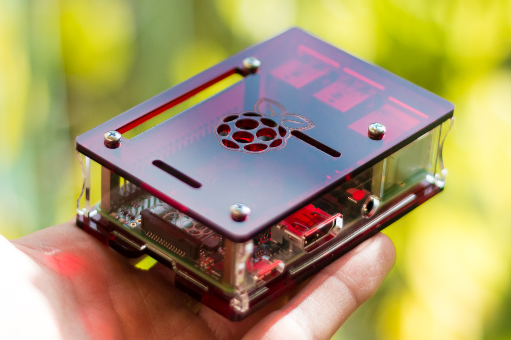

#HSLIDE

## Introduction to Making & Prototyping

Raspberry Pi & Electronics

#VSLIDE

## Instructors

* Dr. Jing S Pang: __j.pang10@alumni.imperial.ac.uk__
* Dr. Ariadna Blanca Romero: __ablancar@ic.ac.uk__
* Raj Shaha: __rajnikant.shah@imperial.ac.uk__

#VSLIDE

## Material and source code available

https://github.com/Starignus/RPIGPIO

#HSLIDE

## Overview

The ROSE API is built on top of the 

<ol>
<li class="fragment" data-fragment-index="2">New `analyze` operation on RDD[OCPUTask]</li>

<li class="fragment" data-fragment-index="3">This operation executes R analytics on OpenCPU</li>

<li class="fragment" data-fragment-index="4">And generates RDD[OCPUResult]</li>

<li class="fragment" data-fragment-index="5">And generates RDD[OCPUResult]</li>
</ol>

The ROSE API is built on top of the <a target="_blank" href="https://github.com/onetapbeyond/opencpu-r-executor">opencpu-r-executor</a> library.

#HSLIDE

## This slidedeck is Python3 compatible!

$$\sum_{i=0}^n i^2 = \frac{(n^2+n)(2n+1)}{6}$$
