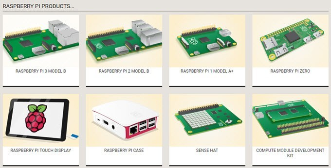
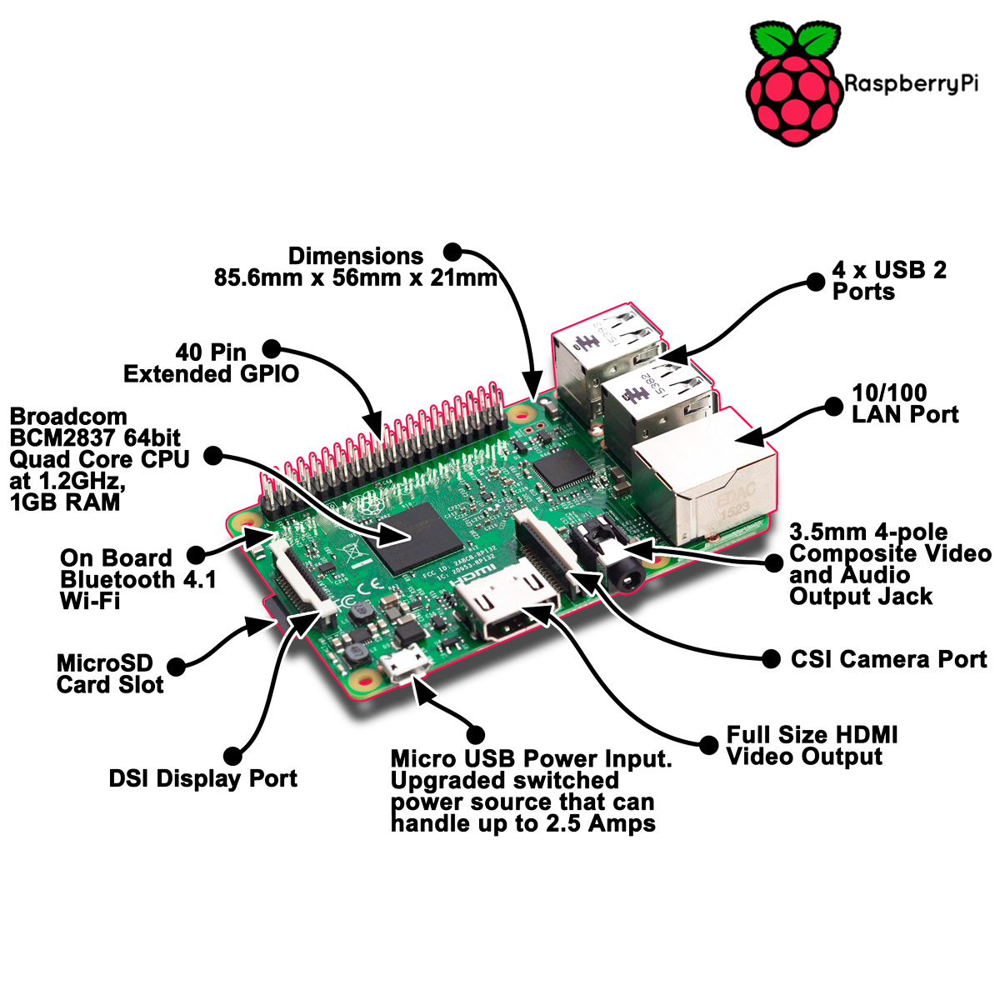
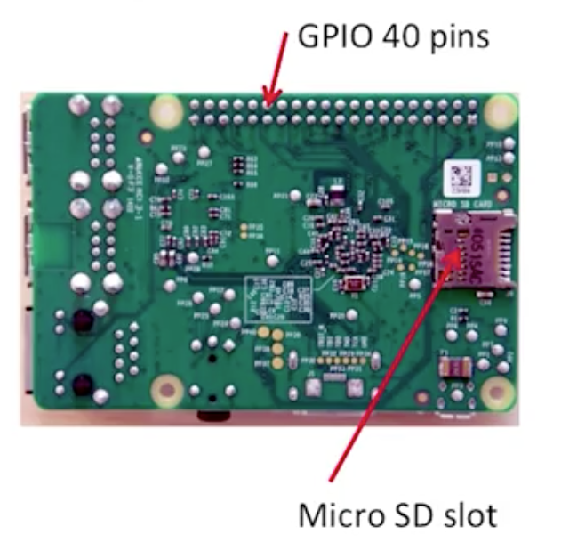
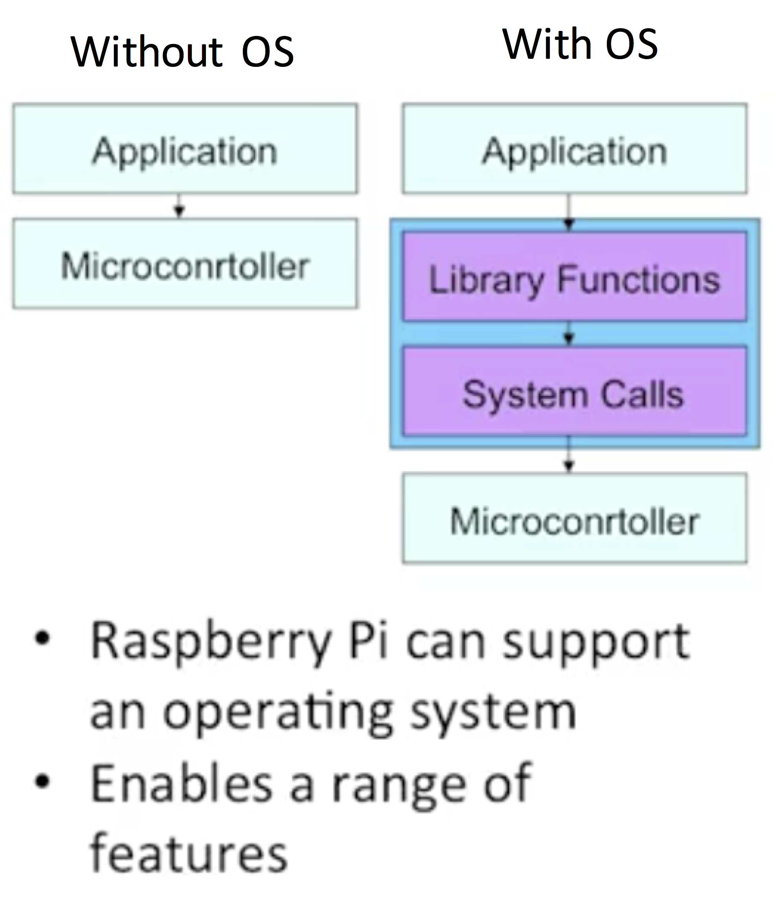
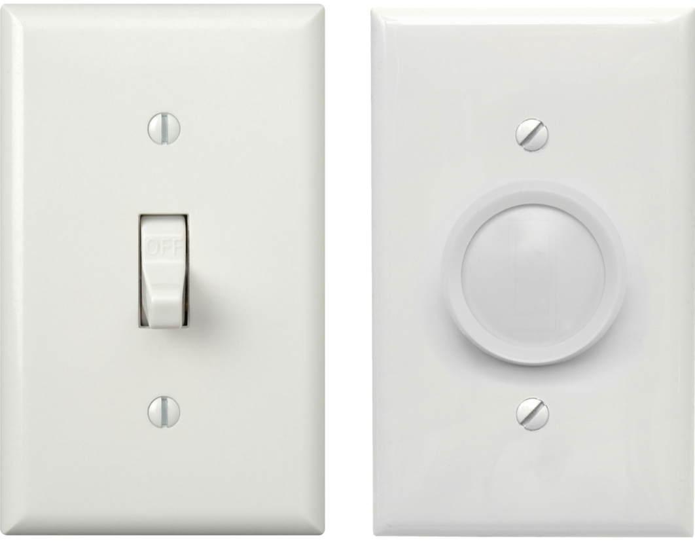

# Introduction to Raspberry Pi

* [What is a Raspberry Pi](#rpi1)
* [Models of Raspberry Pi](#rpi2)
* [Raspberry Pi Board](#rpi3)
* [Why Raspberry Pi?](#rpi4)
* [Is RPi an IoT device?](#rpi5)
* [General Purpose I/O Pins (GPIO)](#rpi6)
* [Digital and Analogue](#rpi7)

##  What is a Raspberry Pi

Raspberry Pi is a small computer of the size of a credit card that you can plug in a TV/monitor, keyboard and mouse. You can use it in the same way as you desktop PC or laptop does, like generating spreadsheets, word processing, browsing the internet, and playing games. It also plays high-definition video. However, what does more interesting Raspberry Pi (RPi), is the capability to make electronics projects with it! The main aim of RPI's design is to teach young people to program and to create new ideas. It has a free licence Linux operative system hold in an SD card and powered by a USB phone charger.

##  Models of Raspberry Pi

There are different models of Raspberry Pi.

All of them have different hardware specifications.

We will be working with the **RPi 3 Model B** that was launched in February 2016; The microprocessor is a Broadcom chip BCM2837 SoC [1](#myfootnote1),  it uses a 1.2GHz 64-bit quad-core ARM Cortex-A53 CPU, has 1GB RAM, integrated 802.11n wireless LAN, and Bluetooth 4.1.

<a name="myfootnote1">1</a>: SoC: System on Chip. A computer on a single chip.

##  Raspberry Pi Board

The RPi board shown in the figure, at the right-hand side, you have the **USB ports** and blow that on the right is the port for **Ethernet**. Behind the USB ports,  there is an **interface IC chip** or controller of the USBs and Ethernet. At the top,  you can find the general purpose **I/O GPIO pins** (40 pins). Down the bottom middle is the **CSI (Camera Serial Interface) camera** connector. You can get a camera for Raspberry PI and plug it in. Also, you have the option to connect a webcam to a USB. At the right-hand side, you can find a **DSI (Display Serial Interface) connector** which you can use to connect an LCD screen. At the bottom, you can find the **HDMI port**. HDMI to plug it straight into a monitor. At the bottom, you can find the HDMI port. HDMI to plug it straight into a monitor. Next to the HDMI you can see the **USB power connector** and also an **audio port**.

### Important

* Always make sure you supply only 5 V to the RPi.
* Unlike Arduino, RPi does not have over-voltage protection on the board (yet) as Arduino, be careful when making GPIO connections.
* Please DO NOT connect over 3.3V  or less than + 0V as input.
* Never demand that any output pin source or sink more than 16 mA.
* Pins can supply only maximum 50 mA.

##  Why Raspberry Pi?

Why we chose RPI? When you compare RPI with Arduino, at first instance you can think that RPI is just faster and better and superior (Better processor and RAM memory). However,  Arduino, even though is older,  is well suited to certain tasks. Therefore, I would not say RPi is superior to Arduino or Arduino is superior to RPi. It just depends on what you want to use them. They are different and suitable for various aims.

| Name | Raspberry Pi 3 B | Arduino 101 or Genuino 101|
| ----- | -----| ---- |
| Release | February 2016 | October, 2016|
| Size | 85.60 mm × 56.5 mm | 68.6 mm × 53.4 mm |
|Processor| 64-bit quad-core ARM Cortex-A53 | 32-bit Intel Curie, two tiny cores an x86 (Quark SE) and an ARC|
|Frequency| 1.2GHz | 32MHz|
| RAM | 1 GB | 24 kB|
| Flash Memory| SD card (2 to 16 GB) | 196 Kb|
|Operating system| Linux | None|
|Integrated Development Environment| Scratch, IDLE, any that Linux support| Arduino IDE|
| On Board Network| 10/100 Mbit/s Ethernet, 802.11n wireless, Bluetooth 4.1 | Bluetooth LE|
| Multitasking| Yes |No|
|Operating Voltage | 5 V   | 3.3V (5V tolerant I/O)|
| Input Voltage (recommended)| 5V | 7-12V|
|USB| 1 | 4 (via the on-board 5-port USB hub) |
| Digital GPIO| 17 ( GPIO can be reconfigured as UART, I²C, SPI, PWM)|14  (of which 4 provide PWM output)|
| Analog | 0 | 6 |
|Digital PWM |  | 4 |
|Video Output| HDMI | None|
|Audio Output|HDMI| None|

References of table:
* Arduino [[1](https://www.arduino.cc/en/Main/ArduinoBoard101), [2](https://en.wikipedia.org/wiki/List_of_Arduino_boards_and_compatible_systems)]
* RPI [[1](https://en.wikipedia.org/wiki/Raspberry_Pi#RAM), [2](http://elinux.org/RPi_Low-level_peripherals#cite_note-7)]

Another main difference between RPI and Arduino is that RPI has an operative system, whereas Arduino has not. The latter, you can run the code and run directly on the microcontroller. The presence of an operative system, make all the precess slower since the application does not directly interact with the microcontroller. What it means is that the application can not change a pin directly (turn from high to low or low to high), it has to go through the operative system. But there are many advantages of having an operative system.

The first thing you get is really a user interface. Arduino does not have a real user interface. It means that can do too much with it unless you write a program telling how to manipulate the pins, and may be is going to do something. In the case of having an operative system as in PRI, you can perform different tasks at the same time (multitasking); send and email, browsing the internet, coding and run the code to control the pins. We will see more about the RPI-Linux operating system with more detail in a bit.

##  Is RPi an Iot device?

* **May be—** Depends on how it is used.
* **Similarities**
  * Network connectivity and computational processing power.
  * Small and cheap (relative to a PC)
  * Can interface directly with sensors and actuators via pins.
  * The complexity of the system is not visible (interact via buttons, web apps).
  * **Differences**
  * Interface can be exactly the same as a PC with Linux.
  * The complexity of the system is visible.

##  General Purpose I/O Pins (GPIO)

Your Raspberry Pi is more than just a small computer; it is a hardware prototyping tool! The RPi has **bi-directional I/O pins**, which you can use to drive LEDs, spin motors, or read button presses. To drive the RPi's I/O lines requires a bit or programming. You can use a [variety of programming languages](http://elinux.org/RPi_Low-level_peripherals#GPIO_Code_examples), but we decided to use a reliable, easy tools for driving I/O: **Python**.

###  GPIO Pinout

Raspberry has its GPIO over a standard male header on the board. From the first models to the latest, the header has expanded from 26 pins to 40 pins while maintaining the original pinout.

There are (at least) two, different numbering schemes you may encounter when referencing **Pi pin numbers**:

1. **Broadcom chip-specific** pin numbers.
2. **P1 physical** pin numbers.

You can use either number-system, but when you are programming how to use the pins, it requires that you declare which scheme you are using at the very beginning of your program. We will see this later.

The next table shows all 40 pins on the P1 header, including any particular function they may have, and their dual numbers:

In the next table, we show another numbering system along with the ones we showed above: Pi pin header numbers and element14 given names, wiringPi numbers, Python numbers, and related silkscreen on the wedge. The Broadcom pin numbers in the table are related to RPi Model 2 and later only.

This table shows that the RPi not only gives you access to the bi-directional I/O pins, but also [Serial (UART)](https://learn.sparkfun.com/tutorials/serial-communication), [I2C](https://learn.sparkfun.com/tutorials/i2c), [SPI](https://learn.sparkfun.com/tutorials/serial-peripheral-interface-spi), and even some Pulse width modulation ([PWM](https://learn.sparkfun.com/tutorials/pulse-width-modulation) — “analog output”).

##  Digital and Analog

RPI has just digital I/O (not analogue). GPIO outputs are easy; they are on or off, HIGH or LOW, 3v or 0v. But let us revise what is the difference between **analogue** and **digital** signals.

Both are used to transmit information, usually through **electric signals**. In both these technologies, the information, such as any audio or video, is transformed into electrical signals. The **difference between analogue and digital**:

* In **analogue technology** (continue signal), information is translated into electric pulses of varying amplitude.

* In **digital technology** (discrete signal), translation of information is into binary format (zero or one) where each bit is representative of two distinct amplitudes.

To make an analogy for analogue and digital, you can think of a typical light switch versus a dimmer switch. Digital is like the switch on the left of the figure bellow; it can be either on or off (binary state). analogue, on the other hand, can be set at a range of values between fully on and completely off.

#### Comparison chart

| |Analog |Digital|
|:------|:-------|:-------|
|**Signal**| Analog signal is a continuous signal which represents physical measurements.|    Digital signals are discrete time signals generated by digital modulation.|
|**Waves**|    Denoted by sine waves.|    Denoted by square waves.|
|**Representation**| Uses continuous range of values to represent information.|    Uses discrete or discontinuous values to represent information.|
|**Example**|    Human voice in air, analogue electronic devices.|    Computers, CDs, DVDs, and other digital electronic devices.|
|**Technology**| Analogue technology records waveforms as they are.|    Samples analogue waveforms into a limited set of numbers and records them.|
|**Data transmissions**|Subjected to deterioration by noise during transmission and write/read cycle.|Can be noise-immune without deterioration during transmission and write/read cycle.|
|**Response to Noise**|    More likely to get affected reducing accuracy|    Less affected since noise response are analogue in nature|
|**Flexibility**|    Analog hardware is not flexible.|Digital hardware is flexible in implementation.|
|**Uses**|Can be used in analogue devices only. Best suited for audio and video transmission.|    Best suited for Computing and digital electronics.|
|**Applications**|Thermometer|PCs, PDAs|
|**Bandwidth**|    Analog signal processing can be done in real time and consumes less bandwidth.|    There is no guarantee that digital signal processing can be done in real time and consumes more bandwidth to carry out the same information.|
|**Memory**| Stored in the form of wave signal.|Stored in the form of binary bit.|
|**Power**|    Analog instrument draws large power.|    Digital instrument drawS only negligible power.|
|**Cost**|Low cost and portable.|    Cost is high and not easily portable.|
|**Impedance**|    Low    |High order of 100 megaohms|
|**Errors**|Analogue instruments usually have a scale which is cramped at lower end and give considerable observational errors.|    Digital instruments are free from observational errors like parallax and approximation errors.|
