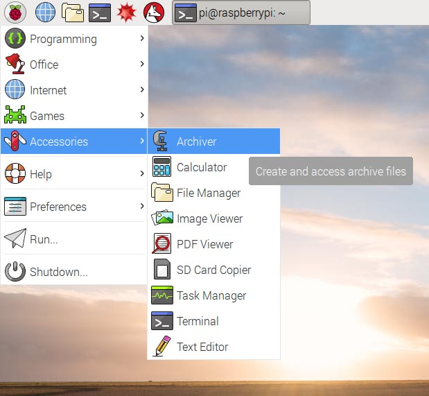
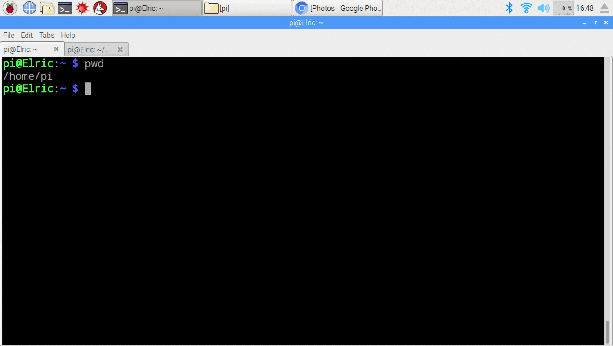

# Operating System Raspbian (Linux)

* [Introduction to Raspbian](#rpi1)
* [Linux Basics](#rpi2)
* [Raspberry Pi Configuration (Optional)](#rpi3)

## <a name="rasp1"></a> Introduction to Raspbian

Raspberry Pi has an operating system called Raspbian, which is the official supported Operating System. Download it [here](https://www.raspberrypi.org/downloads/), or use NOOBS, an easy installer for Raspbian and more. Then you have to copy the image to your SD card.

The advantage of having an operating is getting a user interface. It gives easy access to a regular user for giving commands to the computer and do basic things, without writing any code. The user can just sit there and do things with a computer and get results or do something interesting. In general, for any Linux base operative system, you have two different interfaces: **Graphic interface** and **Text-based interface (terminal or console)**.

<p align="center">

</p>

* In the  Text-based interface, there are no pull-down menus—you will note a pull-down menu on the top, but it is only accessible when you open the terminal from the Graphic interface, so ignore it for the moment. In the  Text-based interface or terminal,  you just type commands and it prints out the results.
* By now, you might ask *why not always use the graphic interface?* People are very used to the graphic interfaces nowadays, but before it was possible to have one, the Unix system from which Linux originated was only accessible from a terminal and using command lines. The bright side of having a Text-based interface is that give you more control and accessibility to your operative system. The only thing you have to do is to **memorise some commands or look up for them**. It gives you the possibility to control it, programming it remotely without the usage of many resources—the Graphic interface uses a lot of the RAM memory.
* The Graphic user interfaces even though it is easier to use, it **does not give you access to all the possibilities and capabilities of the operative system**.

In our class, we will stick more with the Graphic interface (it is easier for beginners). However, some tasks are easier to do with the Text-based interface so that we will access the Text-based interface from the Graphic interface to get familiar with the command lines. If you love programming and making prototypes, you will be mostly using the Text-based interface; you will love it!

## <a name="rasp2"></a> Linux Basics

There are many types of Shells, but the one implemented in Raspbian is BASH. So here are some basic commands to start exploring. So open a terminal in your RPI from the icon in the menu bar on the left.

<p align="center">

</p>

Then we can type some basic commands. For example **pwd**. It shows the path where we are working. Also, we can use  **man** which  givs information about any Linux command
RPI setup. Another useful command is  *ls*, which let us know the folders contained in a directory. *ls -alrt* give us more information of the system and it orders in reverse order of how the files were created.
There are some basic

<p align="center">

</p>

You can find more commands [here](/Bash_script/Cheat_sheet_bash_Linux), and you can play to get used to the command line.

## <a name="rasp3"></a> Raspberry Pi Configuration (Optional)

 Each team should get a monitor, keyboard and mouse.
* Insert the mini SD card in the Raspberry Pi , connect the mouse and keyboard in the USB ports, and the display with provided HDMI-DVI cable. Then,  using Y-cable, power it up by plugging in the charger.
* The operative system starts. Then, click on the __terminal__ icon next to the menu to open it.
* Then you need to run some commands in the terminal as root user to configure the Raspberry Pi (RPi). The **root user** has the permission to modify files or default settings as administrator providing the root password. The **root user** is **pi** and the default **root password** is **raspberry**. First we will make stronger the password, but first, we will change some default setups:

``` bash
$ sudo raspi-config
```
**Note:** To execute any Linux command as root user, the *sudo* command presides the Linux command.

* The terminal will show a menu which can be navigated with the arrows on your keyboard and accept options with Enter.

<p align="center">

</p>

* Then we set up the keyboard to prevent any problem when changing the password. Therefore we access the option: __Internationalisation Options --> Change the Keyboard Layout__. Then we choose generic 105 key, and then the UK.
* Also we have the option to change the timezone from this menu.

<p align="center">

</p>

* To change the password, we return to the main menu and choose the second option. We have to set the new password and do not reboot the RPi yet.

*  We check that the [ssh](https://en.wikipedia.org/wiki/Secure_Shell) for remote network communications is enabled (security shell cryptographic network protocol). We access to the __Advance Options --> SSH__.

<p align="center">

</p>

* An optional step is to change the hostname in the same advance menu.
* Then we restart the RPi.
